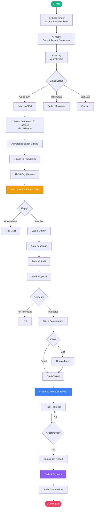
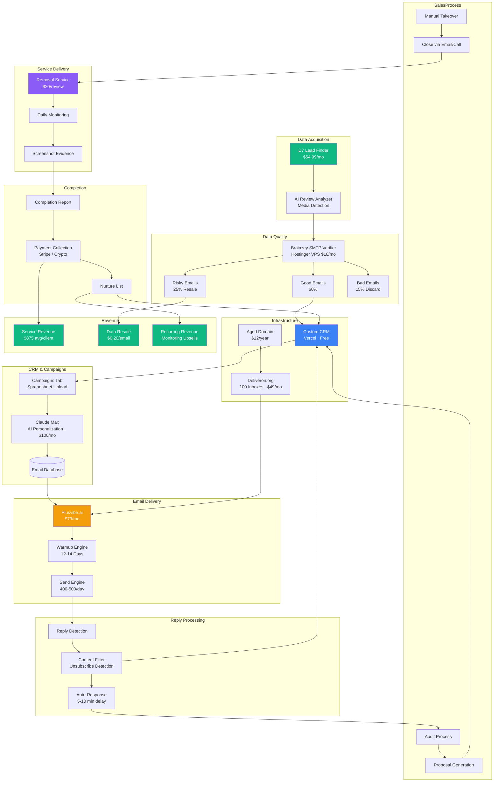
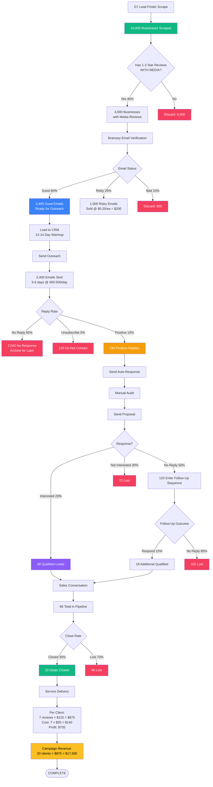
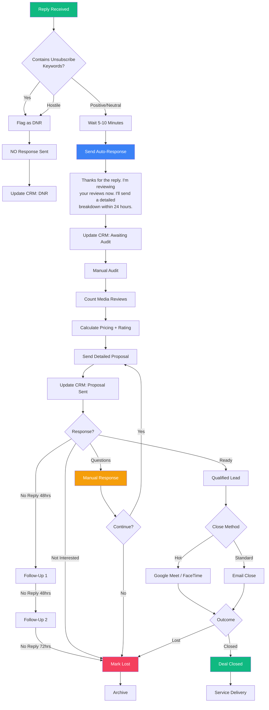
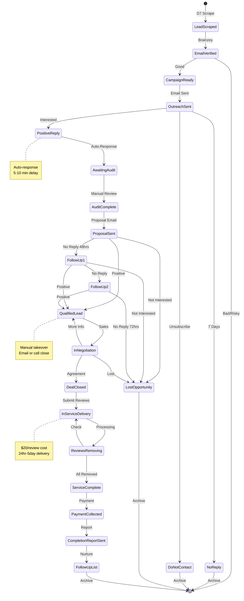

<div align="center">

# 2NDIMPRESSION.CO

### Reputation Management Business

### Operations Manual

---

**Version 2.0** · **January 2025**

**Owner:** Archer Wolfe

---

</div>

<div style="page-break-after: always;"></div>

---

<div align="center">

## TABLE OF CONTENTS

</div>

| Section | Page |
|:--------|-----:|
| **01** · Executive Summary | 3 |
| **02** · Service & Pricing | 5 |
| **03** · Technology Stack | 8 |
| **04** · System Architecture | 12 |
| **05** · Lead Acquisition Funnel | 15 |
| **06** · AI Campaign Engine | 20 |
| **07** · Email Infrastructure | 25 |
| **08** · Reply Handling System | 30 |
| **09** · Customer Pipeline | 35 |
| **10** · Service Delivery | 40 |
| **11** · Sales Playbook | 45 |
| **12** · Daily Operations | 50 |
| **13** · Financial Model | 55 |
| **14** · Scaling Roadmap | 60 |

---

<div style="page-break-after: always;"></div>

---

<div align="center">

# 01

## EXECUTIVE SUMMARY

</div>

---

### The Business

2ndimpression.co is a reputation management agency specializing in the removal of negative Google reviews containing media (photos and videos). We target 1-star and 2-star reviews with visual content because they are both the most damaging to businesses and the easiest to remove through proper Google policy appeals.

---

### The Model

<div align="center">

| Element | Detail |
|:-------:|:------:|
| **Service** | Remove 1-2 star reviews with media |
| **Guarantee** | 100% removal success |
| **Payment** | Pay after results only |
| **Timeline** | 24-48 hours typical, 5 days max |

</div>

---

### The Pricing

<div align="center">

| Volume | Price per Review |
|:------:|:----------------:|
| 1-24 reviews | **$125** |
| 25-49 reviews | **$110** |
| 50+ reviews | **$90** |

</div>

*Discounts apply per individual business, not cumulative across clients.*

---

### The Economics

<div align="center">

| Metric | Value |
|:------:|:-----:|
| Your cost per review | $20 |
| Selling price | $125 |
| **Gross margin** | **84%** |

</div>

---

### Target Industries

<div align="center">

**Hotels** · **Restaurants** · **Auto Shops** · **Tattoo Parlors** · **City Favorites**

</div>

Businesses in major US cities with high volumes of photo/video reviews.

---

<div style="page-break-after: always;"></div>

---

<div align="center">

### Complete Customer Journey

</div>



---

<div style="page-break-after: always;"></div>

---

<div align="center">

# 02

## SERVICE & PRICING

</div>

---

### What We Remove

We exclusively target negative Google reviews (1-star and 2-star) that contain photos or videos.

**Why media reviews only:**

1. **Higher removal success** — Policy violations are clearer with visual content
2. **Lower cost structure** — $20 flat per review regardless of quantity
3. **Maximum client impact** — Visual reviews are 3x more likely to be read

---

### Pricing Structure

<div align="center">

| Tier | Review Count | Price per Review | Example |
|:----:|:------------:|:----------------:|:-------:|
| **Standard** | 1-24 | $125 | 10 reviews = $1,250 |
| **Volume** | 25-49 | $110 | 30 reviews = $3,300 |
| **Enterprise** | 50+ | $90 | 60 reviews = $5,400 |

</div>

---

### How Discounts Work

**Correct:**
- Business A has 30 media reviews → $110/review
- Business B has 15 media reviews → $125/review

**Incorrect:**
- ❌ Combining multiple businesses for volume pricing
- ❌ Carrying over discounts from previous clients

---

### Upsell Service

For clients wanting comprehensive cleanup, offer non-media review removal at premium pricing.

<div align="center">

| Service | Your Cost | Selling Price | Notes |
|:-------:|:---------:|:-------------:|:-----:|
| Media reviews | $20/review | $125/review | Primary service |
| Non-media reviews | $300/review | Negotiate | Upsell only |

</div>

---

### Service Guarantee

<div align="center">

**100% Removal Guarantee**

No removal = No payment

First review removed FREE

</div>

---

<div style="page-break-after: always;"></div>

---

### Real-World Pricing Examples

---

**Example 1: Small Restaurant**

| Detail | Value |
|:------:|:-----:|
| 1-star with photos | 8 |
| 2-star with videos | 5 |
| **Total media reviews** | **13** |
| Pricing tier | Standard (1-24) |
| **Client pays** | 13 × $125 = **$1,625** |
| Your cost | 13 × $20 = $260 |
| **Your profit** | **$1,365** |

---

**Example 2: Mid-Size Hotel**

| Detail | Value |
|:------:|:-----:|
| 1-star with photos | 18 |
| 2-star with videos | 14 |
| **Total media reviews** | **32** |
| Pricing tier | Volume (25-49) |
| **Client pays** | 32 × $110 = **$3,520** |
| Your cost | 32 × $20 = $640 |
| **Your profit** | **$2,880** |

---

**Example 3: Large Retail Chain**

| Detail | Value |
|:------:|:-----:|
| 1-star with photos | 35 |
| 2-star with videos | 28 |
| **Total media reviews** | **63** |
| Pricing tier | Enterprise (50+) |
| **Client pays** | 63 × $90 = **$5,670** |
| Your cost | 63 × $20 = $1,260 |
| **Your profit** | **$4,410** |

---

<div style="page-break-after: always;"></div>

---

<div align="center">

# 03

## TECHNOLOGY STACK

</div>

---

### Monthly Infrastructure Costs

<div align="center">

| Component | Tool | Monthly Cost |
|:---------:|:----:|:------------:|
| Lead Scraping | D7 Lead Finder (Agency) | $54.99 |
| Email Verification | Brainzey (Custom) | $18.00 |
| Email Inboxes | Deliveron.org | $49.00 |
| Domain | 90+ day aged .com | $1.00 |
| Email Sequencing | Plusvibe.ai | $79.00 |
| AI Engine | Claude Max | $100.00 |
| CRM | Custom (Vercel) | $0.00 |
| Web Scraping | Firecrawl.dev | $0.00 |
| **TOTAL** | | **$301.99** |

</div>

---

### D7 Lead Finder

**Plan:** Agency · **Cost:** $54.99/month

<div align="center">

| Feature | Included |
|:-------:|:--------:|
| Daily Searches | 30 |
| Estimated Daily Leads | ~10,000 |
| Emails & Website URLs | ✓ |
| Postal Address / Telephone | ✓ |
| Social Profiles | ✓ |
| Review Scores (FB/Google/Yelp) | ✓ |
| Business Google Ranking | ✓ |
| Instagram Data | ✓ |
| Website Data | ✓ |

</div>

---

### Brainzey (Custom SMTP Verifier)

<div align="center">

| Spec | Detail |
|:----:|:------:|
| Language | Python |
| Repository | github.com/archerverified/brainzey.git |
| Hosting | Hostinger VPS KVM 2 |
| Monthly Cost | $18.00 |

</div>

**Classification Results:**

| Status | Action | Typical % |
|:------:|:------:|:---------:|
| Good | Use for outreach | 60% |
| Risky | Sell to marketers | 25% |
| Bad | Discard | 15% |

---

<div style="page-break-after: always;"></div>

---

### Custom CRM

<div align="center">

| Spec | Detail |
|:----:|:------:|
| Initial Build | Tempo AI |
| Refinement | Cursor + Claude |
| Design Template | Venture by Dhuha Creative |
| Hosting | Vercel (Free Tier) |

</div>

**Features:**
- Lead import and management
- 19-stage pipeline tracking
- Campaign management tab
- AI personalization integration
- Plusvibe.ai export

---

### AI Personalization Engine

<div align="center">

| Component | Detail |
|:---------:|:------:|
| Primary AI | Claude Max |
| Monthly Cap | $100.00 |
| Web Scraping | Firecrawl.dev API |
| API Cost | Free (extended access) |

</div>

---

### Deliveron.org

**Cost:** $49/month per domain

<div align="center">

| Feature | Included |
|:-------:|:--------:|
| Microsoft Outlook Inboxes | 100 |
| Monthly Email Capacity | 15,000 |
| DNS Authentication | SPF, DKIM, DMARC |
| Custom Tracking Domains | ✓ |
| Custom Nameservers | ✓ |

</div>

---

### Plusvibe.ai

**Cost:** $79/month

- Campaign automation
- Email sequencing
- 12-14 day warmup handling
- Deliverability optimization

---

<div style="page-break-after: always;"></div>

---

<div align="center">

# 04

## SYSTEM ARCHITECTURE

</div>

---

### Complete Infrastructure Map



---

<div style="page-break-after: always;"></div>

---

### Component Specifications

---

**Data Acquisition**

| Component | Purpose | Capacity | Cost |
|:---------:|:-------:|:--------:|:----:|
| D7 Lead Finder | Scrape Google Business data | 10K+/day | $54.99/mo |
| AI Review Analyzer | Count media reviews | Unlimited | Included |

---

**Email Infrastructure**

| Component | Purpose | Capacity | Cost |
|:---------:|:-------:|:--------:|:----:|
| Domain (90+ days) | Sender reputation | 1 | $12/year |
| Deliveron.org | 100 inboxes + DNS | 15K sends/mo | $49/mo |
| Plusvibe.ai | Sequencing + warmup | Unlimited | $79/mo |

---

**Service Delivery**

| Component | Purpose | Timeline | Cost |
|:---------:|:-------:|:--------:|:----:|
| Removal Service | Remove policy-violating reviews | 24hrs - 5 days | $20/review |
| Daily Monitoring | Check removal status | Daily | $0 |
| Evidence Collection | Before/after screenshots | On completion | $0 |

---

**Removal Methods (Provider-side):**

1. Google representative contacts
2. Specialized law firms
3. High-ranking Google Guide accounts
4. Third-party services (backup)

**Success Rate:** 100% guaranteed

---

<div style="page-break-after: always;"></div>

---

<div align="center">

# 05

## LEAD ACQUISITION FUNNEL

</div>

---

### Complete Funnel Visualization



---

<div style="page-break-after: always;"></div>

---

### Funnel Conversion Metrics

<div align="center">

| Stage | Volume | From Previous | From Start |
|:-----:|:------:|:-------------:|:----------:|
| Initial Scrape | 10,000 | — | 100% |
| Has Media Reviews | 4,000 | 40% | 40% |
| Good Emails | 2,400 | 60% | 24% |
| Emails Sent | 2,400 | 100% | 24% |
| Positive Replies | 240 | 10% | 2.4% |
| Respond to Proposal | 120 | 50% | 1.2% |
| Qualified Leads | 66 | 55% | 0.66% |
| **Deals Closed** | **20** | 30% | **0.2%** |

</div>

---

### Critical Bottlenecks

---

**Bottleneck 1: Email Verification (40% loss)**

1,600 emails discarded as risky/bad

*Opportunity:* Improve lead source quality, resell risky emails

---

**Bottleneck 2: Reply Rate (90% no response)**

2,160 prospects don't engage

*Opportunity:* A/B test subject lines (could increase to 12-15%)

---

**Bottleneck 3: Proposal Response (50% ghost)**

120 people ask for audit then disappear

*Opportunity:* Add video walkthrough, follow-ups recover 15%

---

**Bottleneck 4: Sales Close (70% don't buy)**

46 qualified leads don't convert

*Opportunity:* Build case studies, add social proof

---

<div style="page-break-after: always;"></div>

---

<div align="center">

# 06

## AI CAMPAIGN ENGINE

</div>

---

### How AI Generates Personalized Emails

```mermaid
flowchart TD
    Start[Good Emails from Brainzey] --> Export[Export to Spreadsheet]
    
    Export --> Format{Reformat Data}
    Format --> Columns["Required Columns:<br/>• business_name<br/>• contact_email<br/>• first_name<br/>• google_business_url<br/>• current_rating<br/>• total_reviews<br/>• one_star_with_media<br/>• two_star_with_media<br/>• star counts (1-5)"]
    
    Columns --> CRMLoad[Load into CRM]
    
    CRMLoad --> CampTab[Campaigns Tab]
    
    CampTab --> Upload[Upload Spreadsheet]
    
    Upload --> AssignCamp{Assign Campaign Type}
    
    AssignCamp -->|Variation 1| Camp1[Informative/Helpful]
    AssignCamp -->|Variation 2| Camp2[Specific/Direct<br/>RECOMMENDED]
    
    Camp1 --> Syntax1["Syntax:<br/>{{business_name}}<br/>{{first_name}}<br/>Generic value prop"]
    Camp2 --> Syntax2["Syntax:<br/>{{business_name}}<br/>{{first_name}}<br/>{{media_review_count}}<br/>{{current_rating}}<br/>{{projected_rating}}<br/>{{price_per_review}}<br/>{{total_price}}"]
    
    Syntax1 --> AIProcess[Claude Max<br/>AI Personalization]
    Syntax2 --> AIProcess
    
    AIProcess --> Loop{Process Each Row}
    
    Loop --> Extract[Extract Business Data]
    Extract --> AI[Generate Personalized Email]
    AI --> Calc[Calculate Projected Rating<br/>+ Pricing Tier]
    Calc --> Store{Storage}
    
    Store -->|Option A| Database[(CRM Database)]
    Store -->|Option B| Spreadsheet[Export for Review]
    
    Database --> Ready1[Ready for Plusvibe]
    Spreadsheet --> Review[Manual Review]
    Review --> Ready1
    
    Ready1 --> Complete[Campaign Ready]
    
    style Start fill:#10b981,color:#fff
    style AIProcess fill:#fbbf24,color:#000
    style Complete fill:#10b981,color:#fff
```



---

<div style="page-break-after: always;"></div>

---

### Campaign Template: Variation 2 (Recommended)

---

**Subject:** Your {{business_name}} Google reviews - quick fix available

---

```
Hey {{first_name}}. I noticed that you have {{media_review_count}} negative 
reviews with photos/videos on Google for {{business_name}}.

As you probably know, these reviews with images are the most damaging - 
they're 3x more likely to be seen and trusted by potential customers.

My business focuses on removing these types of reviews from Google and 
other platforms.

Right now, I can remove all {{media_review_count}} of these media reviews 
this week.

Your rating will jump from {{current_rating}} to {{projected_rating}} 
within 7-14 days if all {{media_review_count}} reviews are removed.

PRICING:
- 1-24 reviews: $125 per review
- 25-49 reviews: $110 per review  
- 50+ reviews: $90 per review

Your total: {{media_review_count}} reviews × ${{price_per_review}} = ${{total_price}}

If you're interested, I can remove the first one for free so you know 
I'm serious. For the remainder, you only pay after all reviews are removed.

Regards,
Archer
```

---

### Syntax Variables

| Variable | Source | Example |
|:--------:|:------:|:-------:|
| `{{first_name}}` | CRM | "Joe" |
| `{{business_name}}` | D7 | "Joe's Pizza" |
| `{{media_review_count}}` | AI Analysis | 13 |
| `{{current_rating}}` | D7 | 3.4 |
| `{{projected_rating}}` | Calculated | 3.7 |
| `{{price_per_review}}` | Tier Logic | 125 |
| `{{total_price}}` | Calculated | 1625 |

---

<div style="page-break-after: always;"></div>

---

### Projected Rating Calculation

```python
def calculate_projected_rating(data):
    """Calculate rating after removing media reviews only"""
    
    # Current totals
    total_reviews = data['total_reviews']
    one_star = data['one_star_count']
    two_star = data['two_star_count']
    three_star = data['three_star_count']
    four_star = data['four_star_count']
    five_star = data['five_star_count']
    
    # Media reviews (what we remove)
    one_star_media = data['one_star_with_media']
    two_star_media = data['two_star_with_media']
    media_review_count = one_star_media + two_star_media
    
    # Current rating
    current_points = (1*one_star) + (2*two_star) + (3*three_star) + (4*four_star) + (5*five_star)
    current_rating = current_points / total_reviews
    
    # After removal
    remaining_reviews = total_reviews - media_review_count
    new_one_star = one_star - one_star_media
    new_two_star = two_star - two_star_media
    
    new_points = (1*new_one_star) + (2*new_two_star) + (3*three_star) + (4*four_star) + (5*five_star)
    projected_rating = new_points / remaining_reviews
    
    # Pricing tier
    if media_review_count >= 50:
        price_per_review = 90
    elif media_review_count >= 25:
        price_per_review = 110
    else:
        price_per_review = 125
    
    return {
        'current_rating': round(current_rating, 1),
        'projected_rating': round(projected_rating, 1),
        'media_review_count': media_review_count,
        'price_per_review': price_per_review,
        'total_price': media_review_count * price_per_review
    }
```

---

### Example Calculation

| Data Point | Value |
|:----------:|:-----:|
| Total Reviews | 100 |
| 1-Star (8 with media) | 15 |
| 2-Star (5 with media) | 10 |
| 3-Star | 20 |
| 4-Star | 30 |
| 5-Star | 25 |

**Current:** 340 points ÷ 100 = **3.4 stars**

**After removing 13 media reviews:** 322 points ÷ 87 = **3.7 stars**

**Pricing:** 13 × $125 = **$1,625** (Your profit: $1,365)

---

<div style="page-break-after: always;"></div>

---

<div align="center">

# 07

## EMAIL INFRASTRUCTURE

</div>

---

### Infrastructure Overview

<div align="center">

| Component | Provider | Monthly Cost | Capacity |
|:---------:|:--------:|:------------:|:--------:|
| Domain | Any registrar | $1 | 1 |
| Inboxes + DNS | Deliveron.org | $49 | 100 inboxes |
| Sequencing | Plusvibe.ai | $79 | Unlimited |
| **TOTAL** | | **$129** | 15,000 sends/mo |

</div>

---

### Deliveron.org Package

**Cost:** $49/month per domain

| Feature | Included |
|:-------:|:--------:|
| Microsoft Outlook Inboxes | 100 |
| Monthly Sends | 15,000 |
| SPF, DKIM, DMARC | Full setup |
| Custom Tracking Domains | ✓ |
| High-quality Nameservers | ✓ |

---

### Warmup Timeline

| Phase | Duration | Activity |
|:-----:|:--------:|:--------:|
| Deliveron Setup | Days 1-3 | DNS, initial warmup |
| Inbox Personalization | Day 4 | Profile photos, names |
| Plusvibe Warmup | Days 5-18 | 12-14 day ramp |
| **Full Capacity** | **Day 19+** | 400-500 emails/day |

---

### Sender Personas

Three personas across 100 inboxes:

<div align="center">

| Persona | Role | Purpose |
|:-------:|:----:|:-------:|
| **Ellie Dempster** | Outreach Specialist | Female name increases opens |
| **Kelsie Clark** | Client Success | Female name increases opens |
| **Archer Wolfe** | Founder | Google-verified entrepreneur |

</div>

**302 Redirects:** All sending domains redirect to 2ndimpression.co

---

<div style="page-break-after: always;"></div>

---

### Sending Capacity

<div align="center">

| Metric | Value |
|:------:|:-----:|
| Emails per inbox/day | 4-5 |
| Total inboxes | 100 |
| Daily capacity | 400-500 |
| Weekly (Mon-Sat) | 2,400-3,000 |
| Monthly capacity | ~12,000 |
| Deliveron limit | 15,000 |

</div>

---

### Outreach Schedule

<div align="center">

| Setting | Value |
|:-------:|:-----:|
| Days | Monday - Saturday |
| Time Window | 9 AM - 5 PM Central |
| Timezone Target | US only |
| Sunday | No sending |
| Interval | 15-20 min between sends |

</div>

---

### Campaign Pacing

With 2,400 verified emails per campaign:

| Daily Volume | Days to Complete |
|:------------:|:----------------:|
| 400/day | 6 days |
| 500/day | 5 days |
| With buffer | **7-8 days total** |

---

### Scaling (Adding Domains)

<div align="center">

| Domains | Inboxes | Monthly Capacity | Monthly Cost |
|:-------:|:-------:|:----------------:|:------------:|
| 1 | 100 | 12,000 | $129 |
| 2 | 200 | 24,000 | $178 |
| 3 | 300 | 36,000 | $227 |
| 5 | 500 | 60,000 | $325 |
| 10 | 1,000 | 120,000 | $570 |

</div>

*Plusvibe ($79) stays constant. Each domain adds ~$50/mo.*

---

<div style="page-break-after: always;"></div>

---

<div align="center">

# 08

## REPLY HANDLING SYSTEM

</div>

---

### Decision Tree



---

<div style="page-break-after: always;"></div>

---

### Unsubscribe Detection Keywords

<div align="center">

| Keyword | Action |
|:-------:|:------:|
| "unsubscribe" | DNR |
| "remove me" | DNR |
| "stop emailing" | DNR |
| "take me off" | DNR |
| "don't contact" | DNR |
| "not interested" + "stop" | DNR |
| Hostile language | DNR |
| "spam" | DNR |
| "report" | DNR |

</div>

**Action:** Flag in CRM, NO automated response sent

---

### Response Timing

| Action | Delay | Reason |
|:------:|:-----:|:------:|
| Detect positive reply | Immediate | System |
| Send auto-response | 5-10 min | Appear human |
| Complete audit | Within 24 hrs | As promised |
| Send proposal | Same day | Strike while hot |
| Follow-Up 1 | 48 hrs | Decision time |
| Follow-Up 2 | 48 hrs after FU1 | Final attempt |
| Mark Lost | 72 hrs after FU2 | Move on |

---

### Proposal Email Template

**Subject:** Your Google review audit results - {{business_name}}

```
Hi {{first_name}},

I've completed my analysis. Here's what I found:

REMOVABLE REVIEWS:
- {{one_star_media}} one-star reviews with photos/videos
- {{two_star_media}} two-star reviews with photos/videos
- Total: {{media_review_count}} media reviews

IMPACT:
Current rating: {{current_rating}} stars
After removal: {{projected_rating}} stars  
Improvement: +{{improvement}} stars

TIMELINE:
24-48 hours typical, 5 days maximum guaranteed.

PRICING:
{{media_review_count}} reviews × ${{price_per_review}} = ${{total_price}}

First review removed FREE. Pay only after all remaining reviews are removed.

Want to move forward?

- Archer
2ndimpression.co
```

---

<div style="page-break-after: always;"></div>

---

<div align="center">

# 09

## CUSTOMER PIPELINE

</div>

---

### State Machine



---

<div style="page-break-after: always;"></div>

---

### Pipeline Stages

<div align="center">

| # | Stage | Description |
|:-:|:-----:|:-----------:|
| 1 | Lead Scraped | D7 data collected |
| 2 | Email Verified | Brainzey validated |
| 3 | Campaign Ready | Loaded to CRM |
| 4 | Outreach Sent | Email delivered |
| 5 | Positive Reply | Interest shown |
| 6 | Awaiting Audit | Auto-response sent |
| 7 | Audit Complete | Manual review done |
| 8 | Proposal Sent | Pricing delivered |
| 9 | Follow-Up 1 | First follow-up |
| 10 | Follow-Up 2 | Final follow-up |
| 11 | Qualified Lead | Ready for sales |
| 12 | In Negotiation | Active conversation |
| 13 | Deal Closed | Agreement reached |
| 14 | In Service Delivery | Reviews submitted |
| 15 | Service Complete | All removed |
| 16 | Payment Collected | Paid |
| 17 | Follow-Up List | Nurture for upsells |
| 18 | Lost Opportunity | Did not convert |
| 19 | Do Not Contact | Permanent archive |

</div>

---

### Daily Volume Expectations

Based on 400-500 daily emails:

| Stage | Daily Volume | Notes |
|:-----:|:------------:|:-----:|
| Outreach Sent | 400-500 | Full capacity |
| Positive Reply | 8-10 (2%) | Same day |
| Awaiting Audit | 8-10 | Same day |
| Proposal Sent | 8-10 | 24hr turnaround |
| Qualified Lead | 1-2 (20%) | High intent |
| Deal Closed | 1-2 | Conversion |
| In Service Delivery | 5-10 | Accumulates |
| Service Complete | 5-10/week | Based on timeline |

---

<div style="page-break-after: always;"></div>

---

<div align="center">

# 10

## SERVICE DELIVERY

</div>

---

### Workflow

```mermaid
flowchart TD
    Start[Deal Closed] --> Terms{Payment Terms}
    
    Terms -->|Pay After| Defer[Defer Collection]
    Terms -->|Prepay| PayNow[Collect Now]
    
    Defer --> Ticket
    PayNow --> Ticket[Create Service Ticket]
    
    Ticket --> Document[Document Reviews]
    Document --> List["Each Review:<br/>• URL<br/>• Star Rating<br/>• Media Type<br/>• Content"]
    
    List --> Priority{Prioritize}
    
    Priority -->|1-Star Media| P1[Priority 1 Queue]
    Priority -->|2-Star Media| P2[Priority 2 Queue]
    
    P1 --> Submit[Submit to Removal Service]
    P2 --> Submit
    
    Submit --> Track[Track Submission]
    Track --> Monitor[Daily Monitoring]
    
    Monitor --> Check{Status}
    
    Check -->|Still Live| Time{Days Elapsed}
    Time -->|Under 5| Monitor
    Time -->|5+| Escalate[Escalate]
    Escalate --> Monitor
    
    Check -->|Removed| Update[Update CRM]
    Update --> Screenshot[Screenshot Proof]
    Screenshot --> AllDone{All Removed?}
    
    AllDone -->|No| Monitor
    AllDone -->|Yes| CalcNew[Calculate New Rating]
    
    CalcNew --> Compare["Compare:<br/>Old: X.X stars<br/>New: Y.Y stars<br/>Change: +Z.Z"]
    
    Compare --> Report[Create Report]
    Report --> Content["Includes:<br/>• Before/After Screenshots<br/>• Removed Review List<br/>• Rating Improvement<br/>• Timeline Summary"]
    
    Content --> Payment{Payment Status}
    
    Payment -->|Prepaid| Send[Send Report]
    Payment -->|Pay After| Invoice[Invoice + Report]
    
    Invoice --> Collect[Collect Payment]
    Collect --> Confirm{Paid?}
    
    Confirm -->|No| FollowPay[Follow Up]
    FollowPay --> Collect
    Confirm -->|Yes| Send
    
    Send --> UpdateFinal[Update CRM: Complete]
    UpdateFinal --> Nurture[Add to Nurture List]
    
    Nurture --> Upsell{Upsells}
    
    Upsell --> Mon[Ongoing Monitoring]
    Upsell --> Gen[Review Generation]
    Upsell --> Full[Full Reputation Mgmt]
    
    Mon --> Schedule[Schedule Check-Ins]
    Gen --> Schedule
    Full --> Schedule
    
    Schedule --> End([COMPLETE])
    
    style Start fill:#10b981,color:#fff
    style P1 fill:#3b82f6,color:#fff
    style P2 fill:#3b82f6,color:#fff
    style Submit fill:#f59e0b,color:#fff
    style Send fill:#8b5cf6,color:#fff
    style End fill:#f43f5e,color:#fff
```



---

<div style="page-break-after: always;"></div>

---

### Review Priority Matrix

<div align="center">

| Priority | Type | Expected Removal |
|:--------:|:----:|:----------------:|
| **1** | 1-Star with media | 24-48 hours |
| **2** | 2-Star with media | 24-48 hours |

</div>

**Rationale:**
- All media reviews have same cost ($20) and similar removal time
- 1-star reviews damage rating more, so remove first
- Faster visible results = happier client

---

### Service Metrics

| Metric | Target |
|:------:|:------:|
| Removal Success Rate | 100% |
| Avg Removal Time (Media) | 24-48 hrs |
| Maximum Removal Time | 5 days |
| Cost per Review | $20 |
| Escalation Trigger | Day 5+ |

---

### Capacity Planning

| Scenario | Daily Deals | Reviews/Deal | Weekly Load | Status |
|:--------:|:-----------:|:------------:|:-----------:|:------:|
| Low | 1/day | 5 | 35 | ✓ Under |
| Medium | 2/day | 7 | 98 | ✓ Comfortable |
| High | 3/day | 10 | 210 | ⚠ Near max |
| Max | 4/day | 10 | 280 | ✗ Over |

**Throttle Point:** If weekly exceeds 200 removals, pause outreach or raise prices.

---

### Payment Collection

<div align="center">

| Method | Processing Fee |
|:------:|:--------------:|
| Stripe | ~2.9% + $0.30 |
| Crypto | Varies |

</div>

---

<div style="page-break-after: always;"></div>

---

<div align="center">

# 11

## SALES PLAYBOOK

</div>

---

### Communication Channels

| Channel | Usage | Notes |
|:-------:|:-----:|:-----:|
| **Email** | Primary | Most deals close here |
| **Google Meet** | Secondary | For questions/trust building |
| **FaceTime** | Occasional | High-value deals |
| **WhatsApp** | Rare | Uncommon in US |

---

### Objection Handlers

---

**"That's too expensive"**

> Consider this: A single 1-star review can cost you 10-20 customers per month. If your average customer value is $50, that's $500-1000 lost monthly. This investment pays for itself in weeks.

> That's exactly why I offer pay-after-results. You literally see the reviews removed before paying a cent. Zero risk.

---

**"Is this legal?"**

> Removing reviews that violate Google's content policies is 100% within their terms of service. I'm not hacking anything. I'm filing proper appeals for reviews that shouldn't be there.
>
> Think of it like disputing a fraudulent charge on your credit card. The review violates the rules, I navigate the proper removal process.

---

**"Why should I trust you?"**

> That's exactly why I remove the first review for free. You can watch it work before committing.
>
> And payment is after results - you never pay unless reviews are actually removed. I'm taking all the risk, not you.

---

**"Can you guarantee results?"**

> Yes, 100%. Every review I've identified as removable will be removed, or you don't pay. I work with Google representatives and specialized law firms who know exactly how to file these appeals.

---

**"I've tried before and it didn't work"**

> Most business owners try filing appeals through the standard GMB interface. That rarely works because Google's frontline support auto-rejects most appeals.
>
> I use specialized methods and connections with much higher success rates. You've already proven standard methods don't work - that's exactly why you need this service.

---

<div style="page-break-after: always;"></div>

---

### Closing Script

**For ready-to-proceed prospects:**

```
Perfect. Here's how we'll proceed:

1. I'll remove the first review today (free) so you can see it works
2. Once confirmed removed, I'll send a simple scope of work
3. After you sign, I'll remove the remaining reviews
4. Once all confirmed removed, I'll send the invoice
5. You pay only after everything is done

Sound good?
```

---

### Scope of Work

Issue after:
- **Option A:** First free review removed (builds trust)
- **Option B:** Prospect agrees immediately (faster)

**Includes:**
- Reviews to be removed (list with URLs)
- Pricing agreed upon
- Timeline expectations
- Payment terms (pay after results)
- Guarantee terms

---

### No Refund Policy

Because clients pay only after successful removal, refunds are not applicable.

- No upfront payment collected
- Reviews must be confirmed removed before invoicing
- Removed reviews do not return
- If a review is restored, we re-remove at no charge

---

<div style="page-break-after: always;"></div>

---

<div align="center">

# 12

## DAILY OPERATIONS

</div>

---

### Morning Routine (9:00 AM - 10:00 AM)

---

**9:00 AM — Pipeline Check (15 min)**

```
[ ] Log into CRM
[ ] Count prospects per stage:
    Awaiting Audit: ___
    Proposal Sent: ___
    Qualified Lead: ___
    In Negotiation: ___
    In Service Delivery: ___
[ ] Identify urgent follow-ups (48+ hrs)
[ ] Check yesterday's metrics:
    Sent: ___ (target: 400-500)
    Deliverability: ___% (target: >95%)
    Replies: ___ (target: 8-10)
```

---

**9:30 AM — Reply Processing (30 min)**

```
[ ] Open email inbox
[ ] Review overnight replies

For each reply:

UNSUBSCRIBE/HOSTILE → DNR in CRM, no response

POSITIVE/NEUTRAL → 
  Check auto-response sent
  Add to audit queue

QUESTIONS → 
  Draft response within 1 hour

READY TO PROCEED → 
  Move to Qualified Lead
```

---

### Mid-Morning (10:00 AM - 12:00 PM)

---

**10:00 AM — Manual Audits (2 hrs)**

For each prospect in "Awaiting Audit":

```
1. Open Google Business profile
2. Screenshot current rating

3. Count media reviews:
   [ ] 1-star with media: ___
   [ ] 2-star with media: ___
   [ ] TOTAL: ___

4. Calculate pricing:
   1-24: ___ × $125 = $___
   25-49: ___ × $110 = $___
   50+: ___ × $90 = $___
   
   Your cost: ___ × $20 = $___
   Profit: $___

5. Calculate projected rating:
   Current: ___
   After: ___
   Improvement: +___

6. Send proposal email
7. Update CRM: Proposal Sent
8. Set 48hr follow-up reminder
```

---

<div style="page-break-after: always;"></div>

---

### Afternoon (2:00 PM - 5:00 PM)

---

**2:00 PM — Sales Conversations (1 hr)**

```
[ ] Review Qualified Lead stage
[ ] Respond to questions
[ ] For hot prospects, offer call:

    "Happy to walk through this on a quick call.
    Here's my calendar: [Google Meet link]
    Or email works too - your choice."

[ ] Handle objections
[ ] Move closed deals to Service Delivery
[ ] Update CRM notes
```

---

**3:00 PM — Service Delivery Check (1 hr)**

For each client in Service Delivery:

```
1. Check removal service portal

2. Update each review:
   [ ] Review 1: ___ (Pending/Removed)
   [ ] Review 2: ___ (Pending/Removed)
   [ ] Review 3: ___ (Pending/Removed)

3. For REMOVED:
   [ ] Screenshot proof
   [ ] Update CRM
   [ ] If ALL removed → Completion report

4. For PENDING:
   [ ] Days elapsed: ___
   [ ] If 5+ → Escalate
   [ ] If 7+ → Investigate

5. For COMPLETED:
   [ ] Send report + invoice
   [ ] Move to Payment Collection
```

---

### End of Day (5:00 PM - 5:30 PM)

---

**5:00 PM — Follow-Ups & Planning (30 min)**

```
[ ] Follow-Up 1 (proposals 48hrs ago):
    "Wanted to check if you had questions?"

[ ] Follow-Up 2 (FU1 sent 48hrs ago):
    "Circling back one last time..."

[ ] Mark Lost (FU2 sent 72hrs ago)

[ ] Plan tomorrow:
    Audits needed: ___
    Sales calls: ___
    Deliveries: ___
    Payments: ___

[ ] Check daily metrics:
    Sent: ___ (400-500)
    Replies: ___ (8-10)
    Audits: ___
    Proposals: ___
    Closed: ___ (1-2)
```

---

<div style="page-break-after: always;"></div>

---

<div align="center">

# 13

## FINANCIAL MODEL

</div>

---

### Fixed Monthly Costs

<div align="center">

| Expense | Monthly |
|:-------:|:-------:|
| D7 Lead Finder | $54.99 |
| Deliveron.org | $49.00 |
| Plusvibe.ai | $79.00 |
| Hostinger VPS | $18.00 |
| Claude Max | $100.00 |
| Domain (prorated) | $1.00 |
| **TOTAL FIXED** | **$301.99** |

</div>

---

### Variable Costs

| Expense | Cost |
|:-------:|:----:|
| Media review removal | $20/review |
| Non-media removal (upsell) | $300/review |
| Stripe processing | ~2.9% + $0.30 |

---

### Per-Review Economics

<div align="center">

| Metric | Value |
|:------:|:-----:|
| Selling price (Tier 1) | $125 |
| Your cost | $20 |
| Gross profit | $105 |
| **Gross margin** | **84%** |

</div>

---

### Per-Client Economics

Average deal: 7 media reviews at Tier 1

| Metric | Value |
|:------:|:-----:|
| Revenue | 7 × $125 = $875 |
| Removal cost | 7 × $20 = $140 |
| Stripe fee (~3%) | ~$26 |
| **Net profit** | **$709** |
| **Net margin** | **81%** |

---

<div style="page-break-after: always;"></div>

---

### Campaign Economics (Per 10K Scrape)

---

**Revenue**

| Source | Amount |
|:------:|:------:|
| 20 clients × $875 | $17,500 |
| Risky email resale | $200 |
| **Total Revenue** | **$17,700** |

---

**Costs**

| Item | Amount |
|:----:|:------:|
| Review removals (140 × $20) | $2,800 |
| D7 Lead Finder | $55 |
| Deliveron | $49 |
| Plusvibe | $79 |
| Hostinger VPS | $18 |
| Claude Max | $100 |
| Stripe fees (~3%) | $525 |
| **Total Costs** | **$3,626** |

---

**Profit**

| Metric | Value |
|:------:|:-----:|
| Net Profit | $14,074 |
| Net Margin | 79.5% |
| Time invested | ~76 hours |
| **Hourly Rate** | **$185/hr** |

---

### Break-Even Analysis

<div align="center">

| Metric | Value |
|:------:|:-----:|
| Fixed monthly costs | $301.99 |
| Profit per client | $709 |
| **Clients to break even** | **0.43** |

</div>

You break even with less than 1 client per month.

---

<div style="page-break-after: always;"></div>

---

<div align="center">

# 14

## SCALING ROADMAP

</div>

---

### Capacity Constraints

With 1 domain (15K monthly sends):

- Max campaigns/month: 2-3
- Max monthly emails: ~12,000
- Max monthly clients: 15-25

To scale beyond: add domains.

---

### Phase 1: Foundation (Months 1-2)

| Metric | Target |
|:------:|:------:|
| Domains | 1 |
| Inboxes | 100 |
| Email cost | $129/mo |
| Campaigns | 2-3/month |
| Clients | 15-20 |
| Revenue | $13K-18K |
| Profit | $10K-14K |

**Focus:** Validate process, refine messaging, build case studies

---

### Phase 2: Optimization (Months 3-4)

| Metric | Target |
|:------:|:------:|
| Domains | 2 |
| Inboxes | 200 |
| Email cost | $178/mo |
| Campaigns | 4-6/month |
| Clients | 35-50 |
| Revenue | $30K-44K |
| Profit | $25K-36K |

**Focus:** A/B test emails, hire VA for replies, improve conversion

---

### Phase 3: Team Building (Months 5-6)

| Metric | Target |
|:------:|:------:|
| Domains | 4 |
| Inboxes | 400 |
| Email cost | $275/mo |
| Campaigns | 8-10/month |
| Clients | 70-100 |
| Revenue | $61K-88K |
| Profit | $50K-72K |

**Hiring:**
1. Reply Processing VA
2. Sales Closer
3. Delivery Coordinator

---

### Phase 4: Maturity (Months 7-12)

| Metric | Target |
|:------:|:------:|
| Domains | 8-10 |
| Inboxes | 800-1,000 |
| Email cost | $470-570/mo |
| Campaigns | 15-20/month |
| Clients | 140-200 |
| Revenue | $122K-175K/mo |
| Profit | $100K-145K/mo |

**Focus:** Systematize, delegate, build recurring revenue

---

### Cost to Scale

| Item | Cost |
|:----:|:----:|
| Domain registration | $12/year |
| Deliveron per domain | $49/month |
| **Marginal cost** | **~$50/month per domain** |

Plusvibe ($79/mo) remains constant.

---

<div style="page-break-after: always;"></div>

---

<div align="center">

# APPENDIX

## Weekly Metrics Dashboard

</div>

---

### Lead Generation

```
Week of ___________

Leads scraped: _____
Good emails: _____ (__%)
Emails sent: _____
Reply rate: ____% (target: 10%)
Positive replies: _____
Cost per lead: $_____
```

---

### Sales

```
Audits completed: _____
Proposals sent: _____
Proposal response: ____% (target: 50%)
Qualified leads: _____
Sales conversations: _____
Close rate: ____% (target: 30%)
Average deal: $_____
```

---

### Delivery

```
Reviews submitted: _____
Reviews removed: _____
Success rate: ____% (target: 100%)
Avg removal time: ____ days (target: 2-3)
Escalations: _____
```

---

### Financial

```
Revenue: $_____
Costs: $_____
Profit: $_____
Margin: ____%
Hours: _____
Hourly rate: $___/hr
```

---

<div style="page-break-after: always;"></div>

---

<div align="center">

## Emergency Protocols

</div>

---

**Plusvibe account suspended:**

1. Export all active campaigns
2. Switch to backup (Instantly.ai, SendGrid)
3. Re-warm if necessary (7-10 days)
4. Continue manual follow-ups
5. Contact support for suspension reason

---

**Removal service provider down:**

1. Identify in-progress reviews
2. Contact backup providers
3. Resubmit (may eat extra cost)
4. Update clients on 1-2 day delay
5. Find 2-3 new backup providers

---

**Client threatens legal action:**

1. Stop all communication
2. Document everything
3. Consult lawyer if serious
4. Offer full refund to de-escalate if needed
5. Add to permanent DNR

---

<div style="page-break-after: always;"></div>

---

<div align="center">

---

**END OF DOCUMENT**

---

**2ndimpression.co**

Reputation Management Operations Manual

Version 2.0 · January 2025

---

*For internal use only.*

*Contains confidential business information.*

---

</div>
